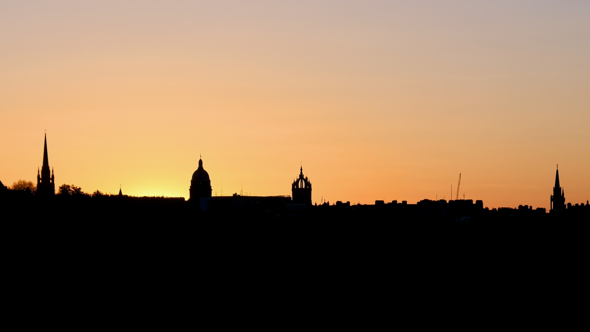
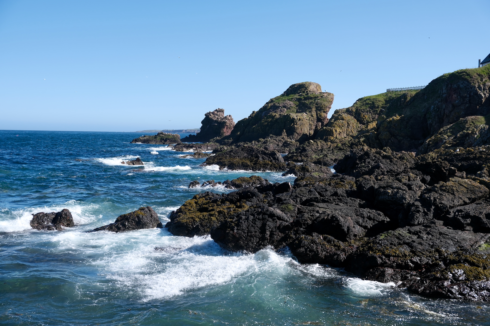
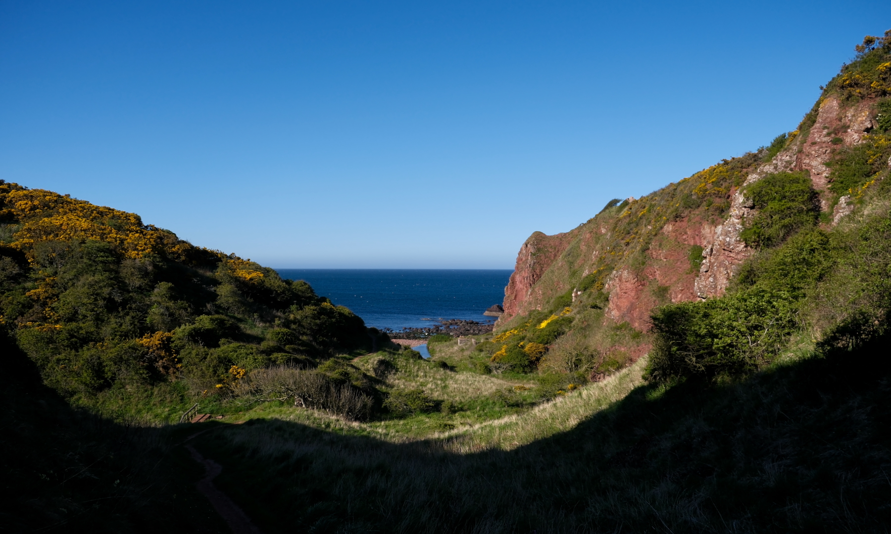
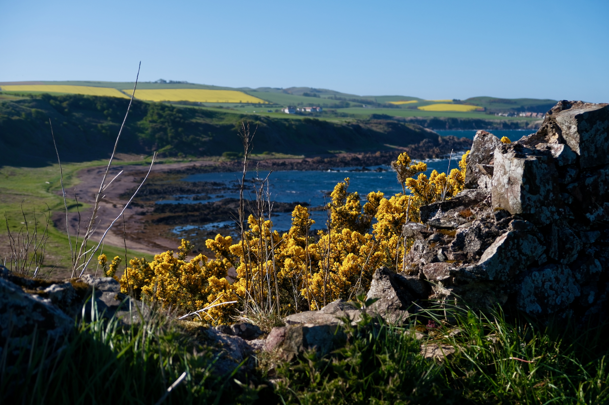

Continuing with tradition – and following previous springtime trips to Aberdeen, Inverness and Dundee – last week I again ventured north.

This time I visited two places I’d only ever glimpsed from the East Coast Main Line: Durham and Berwick-upon-Tweed. I also explored Lindisfarne, spent a day in Edinburgh, and walked part of the Berwickshire coastline from St. Abbs to Eyemouth.

## Durham

A single building draws your attention when crossing the railway viaduct that skirts the edge of Durham, that of its imposing cathedral.

Once described by Bill Bryson as “the best cathedral on planet earth”, it’s certainly one of the more interesting I’ve visited.

Upon entering, the geometric patterns on the pillars lining the nave caught my attention being at odds with the otherwise typical Gothic design. I of course climbed the 325 steps to reach the roof of its central tower, and was rewarded with views of the neighbouring castle and wider city.

- 

- 

- 
{.align-bleed}

I stayed in Durham for 3 nights. It’s a beautiful city and I should have taken more photos of its historic centre. Instead, I spent the rest of my time walking (and running) along the River Wear and strolling around the university’s Botanic Gardens.

## Berwick-upon-Tweed

From Durham I headed northwards to Berwick-upon-Tweed, where I based myself for the rest of my trip.

{.align-bleed}

This small town, whose ownership was long contested between England and Scotland, has three distinct bridges crossing the River Tweed.

Berwick Bridge (or ‘Old Bridge’, opened in 1624) is now limited to one-way traffic heading west. The Royal Tweed Bridge (or ‘New Bridge’, completed in 1928) carries the A1. Meanwhile trains travelling on the East Coast Main Line use the Royal Border Bridge (completed in 1850). I think the later was my favourite.

{.align-bleed}

Near the railway bridge lies remains of Berwick Castle (with the station built on the site of its Great Hall). The old defensive walls surround the center of the town, and these make for a tranquil – if short – elevated walk.

## Lindisfarne

With all Berwick-upon-Tweed’s sights seen within the space of an afternoon, the next day I caught a bus to nearby Beal, and from there walked to the Holy Island of Lindisfarne.

{.align-bleed}

Separated from the mainland by a causeway, I waited over an hour before I could cross it. The alternative was to use Pilgrim’s Way, a path across the mudflats marked by tall poles, but this is not recommended unless accompanied by a local guide.

{.align-bleed}

Once on the island, I tried to speed run its main attractions. Both the castle and the priory were closed, as were most other businesses, having arrived on the main part of the island by late afternoon.

- 

- 

- 
{.align-bleed}

## Edinburgh

The following day, and again looking for nearby attractions, I took the train to Edinburgh, just 45 minutes north.

{.align-bleed}

Via Princes Street Gardens, I headed to Modern Two. After lunch in its cafe and a meander around the galleries, I crossed Belford Road to do the same in Modern One.

{.align-bleed}

From there, via the Water of Leith Walkway, I headed over to Arthur’s Seat. I clambered up to its peak during golden hour where I met the most spectacular sunset. With clear skies, I could even see the Forth Bridge in the distance. I’m not sure I was able to capture the luscious scene that lay before me.

{.align-bleed}

## St. Abbs to Eyemouth

For my final full day in the North East, I again crossed the border into Scotland, this time to follow the coastal path from St. Abbs to Eyemouth.

- 

- 
{.align-bleed}

This path was recommended to me by the taxi driver who drove me back to Berwick two days earlier (and who, it turns out, is Lindisfarne’s postie). Having walked almost 24km on that day, and then half that distance again in Edinburgh, I was glad this route clocked in at 6km.

{.align-bleed}

{.align-bleed}

{.align-bleed}
