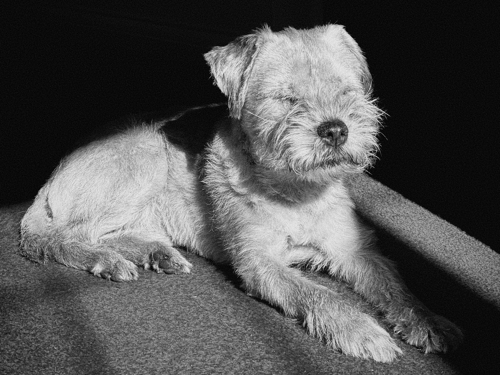

{.align-bleed}

This week my family said goodbye to Teazle, who was put to rest on Tuesday.

She had been a familiar fixture for a good part of my lifetime, having lived to the grand old age of 16. She joined our family in 2009, back when we were living in Walsall and alongside Jenna, [Sage][1] and [Dessie][2]. She had known my nieces since they were babies, and made the move to Bexhill in 2014 with my mum and dad.

Teazle was a small Border Terrier, but what she lacked in stature she made up for in personality.

She was also mission driven, and that mission was food.

Around the same time every morning, when she believed it was time for lunch, she would stand in front of my mum, nudging herself forward every few seconds as if to say let’s go. She would similarly [encourage my dad][3] to fetch her a biscuit in the evening.

She had an unwavering ability to sense when dinner was on the kitchen table, and instinctively knew which of us was going to give her something from it first.

If my brother was eating while sat on the living room floor, she would sit in front of him and show admirable restraint, safe in the knowledge that he would soon give her some of his meal.

Beyond the constant quest for food, important battles would be fought.

She had regular tussles with the floor sweeper, barking at it with vigour until my mum put it back in the cupboard.

She would bark furiously when my mum left the house, then jump onto the back of the sofa to watch her leave.

She would proudly parade with a stuffed rabbit toy in her mouth after running endless circles around me as I made her chase it.

Over the years she became less energetic, eventually losing her eyesight and all of her teeth. She no longer tried to squeeze out the front door when I entered the house, or jump on the sofa to watch me eat my tea. But she remained on hand for kisses, cuddles, ear scratches and tummy rubs, and continued to enjoy [basking in the late afternoon sunshine][4].

She lived a magnificent life, and mine was greatly improved by having her in it.

Rest in peace, my fluffy friend.

[1]: /2011/270/a1/sage/
[2]: /2012/282/a1/dessie/
[3]: /2023/266/p1/
[4]: /2022/086/p1/
